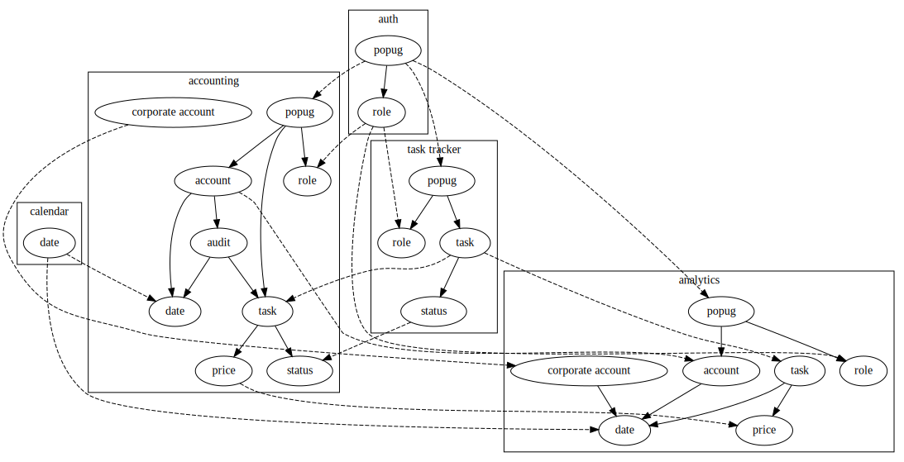

# проектирование домашка 1

## события

actor calendar
command startNewDay
data date
event Calendar.newDayStarted

actor admin
comand hirePopug
data popug
event Popugs.popugHired

actor admin
comand changeRole
data popug
event Popugs.roleChanged

actor popug
comand registerTask
data task
event Tasks.taskRegistered

actor Tasks.taskRegistered event
command assignSingleTask
data task allEngineers
event Tasks.singleTaskAssigned

actor popug
comand assignTasks
data
event Tasks.tasksAssigned

actor engineerPopug
command finishTask
data task engineerPopug
event Tasks.taskFinished

actor Tasks.taskRegistered event
command evaluateTask
data task
event Accounting.taskEvaluated

actor Tasks.singleTaskAssigned event
command checkInSingleTask
data task
event Accounting.singleTaskCheckedIn

actor Tasks.tasksAssigned event
command checkInTasks
data
event Accounting.tasksCheckedIn

actor Accounting.tasksCheckedIn event
command addAuditLines
data popugs tasks
event Accounting.auditLinesAdded

actor Accounting.singleTaskCheckedIn event
command addAuditLine
data popug task
event Accounting.singleAuditLineAdded

actor Accounting.singleTaskCheckedOut event
command addAuditLine
data popug task
event Accounting.singleAuditLineAdded

actor Tasks.taskFinished event
command checkOutTask
data task popug
event Accounting.singleTaskCheckedOut

actor Calendar.newDayStarted event
command paySalary
data accounting
event Accounting.salaryPaid

actor Accounting.salaryPaid event
command sendChecks
data acconting
event Accounting.checksSent

actor Accounting.salaryPaid event
command clearAudit
data accounting
event Accounting.auditCleared

actor Accounting.singleTaskCheckedIn event
command analyseSingleTaskCheckIn
data task price popug
event Analytics.singleTaskCheckInAnalysed

actor Accounting.tasksCheckedIn event
command analyseTasksCheckIn
data task price popug
event Analytics.tasksCheckInAnalysed

actor Accounting.singleTaskCheckedOut event
command analyseSingleTasksCheckOut
data task price popug
event Analytics.singleTaskCheckOutAnalysed

## бизнес цепочки

### создание новой таски в трекере
taskRegistered -> singleTaskAssigned -> singleTaskCheckedIn ->  singleAuditLineAdded

taskRegistered ->  evaluateTask

singleTaskCheckedIn -> singleTaskCheckInAnalysed

### заассайнивание тасков
tasksAssigned -> tasksCheckedIn -> auditLinesAdded

tasksCheckedIn -> tasksCheckInAnalysed

### закрытие задачи
taskFinished -> singleTaskCheckedOut -> singleAuditLineAdded

singleTaskCheckedOut -> singleTaskCheckOutAnalysed

### закрытие дня
newDayStarted -> salaryPaid -> checksSent

salaryPaid -> auditCleared

## модель данных

                         +---------+           +------+            +-------+
        |----------------| account |<----------|popug |----------->| role  |
        |                +---------+           +------+            +-------+
        |                   |                     |
        v                   v                     v
    +------+             +-------+             +------+
    | date |<------------| audit |------------>|task  |-------------o
    +------+             +---+---+             +------+             |
                                                   |                |
                                                   v                v
                                               +-------+        +--------+
                                               | price |        | status |
                                               +-------+        +--------+
     +------------------+
     |corporate account |
     +------------------+

## домены

    +----------------------------------------------------------+
    | calendar domain                                          |
    |                                         +-------+        |
    |                                         |  date |        |
    |                                         +-------+        |
    +----------------------------------------------------------+
    +----------------------------------------------------------+
    | auth domain                                              |
    |                  +-------+                  +------+     |
    |                  | popug |----------------->| role |     |
    |                  +-------+                  +------+     |
    +----------------------------------------------------------+
    +----------------------------------------------------------+
    |  task tracker domain                                     |
    |                                                          |
    |                                                          |
    |                                                          |
    |            +-------+             +-------+               |
    |            | popug |------------>|  role |               |
    |            +-------+             +-------+               |
    |               |                                          |
    |               v                                          |
    |           +------+             +----------+              |
    |           | task |------------>|  status  |              |
    |           +------+             +----------+              |
    +----------------------------------------------------------+
    +---------------------------------------------------------------------------+
    |   accounting domain                                                       |
    |                                                                           |
    |                       +---------+           +------+        +-------+     |
    |      |----------------| account |<----------|popug |------->|  role |     |
    |      |                +---------+           +------+        +-------+     |
    |      |                   |                     |                          |
    |      v                   v                     v                          |
    |  +------+             +-------+             +------+                      |
    |  | date |<------------| audit |------------>|task  |-------------o        |
    |  +------+             +---+---+             +------+             |        |
    |                                                 |                |        |
    |                                                 v                v        |
    |                                             +-------+        +--------+   |
    |                                             | price |        | status |   |
    |                                             +-------+        +--------+   |
    | +------------------+                                                      |
    | |corporate account |                                                      |
    | +------------------+                                                      |
    +---------------------------------------------------------------------------+
    +---------------------------------------------------------------------------+
    |  analytics domain                                                         |
    |                                                                           |
    |                                     +-------------------+                 |
    |                +--------------------| corporate account |                 |
    |                v                    +-------------------+                 |
    |            +------+                 +---------+    +------+    +-------+  |
    |            | date |<----------------| account |<---|popug |--->|  role |  |
    |            +------+                 +---------+    +------+    +-------+  |
    |                ^                                                          |
    |                |                    +------+                   +-------+  |
    |                +--------------------| task |------------------>| price |  |
    |                                     +------+                   +-------+  |
    +---------------------------------------------------------------------------+

### общие данные между доменами

| данные            | calendar | auth | task tracker | accounting | analytics |
|-------------------|----------|------|--------------|------------|-----------|
| date              | v        |      |              | v          | v         |
| popug             |          | v    | v            | v          | v         |
| role              |          | v    | v            | v          | v         |
| task              |          |      | v            | v          | v         |
| status            |          |      | v            | v          | v         |
| price             |          |      |              | v          | v         |
| account           |          |      |              | v          | v         |
| audit             |          |      |              | v          |           |
| corporate account |          |      |              | v          | v         |

## сервисы в системе

- auth
- calendar
- task tracker
- accounting
- analytics

### связи между сервисами

между сервисами все связи должны быть асинхронными

между сервисами и фронтом связи должны быть синхронными

## бизнес события

| сервис источкик | сервис потребитель | событие              |
|-----------------|--------------------|----------------------|
| task tracker    | accounting         | taskRegistered       |
| task tracker    | accounting         | singleTaskAssigned   |
| task tracker    | accounting         | TasksAssigned        |
| task tracker    | accounting         | taskFinished         |
| accounting      | analytics          | singleTaskCheckedIn  |
| accounting      | analytics          | singleTaskCheckedOut |
| calendar        | accounting         | newDayStarted        |
| acconting       | analytics          | salaryPaid           |

## CUD events

| сервис источник | сервис потребитель | данные            |
|-----------------|--------------------|-------------------|
| auth            | task tracker       | popug             |
| auth            | accounting         | popug             |
| auth            | analytics          | popug             |
| auth            | task               | role              |
| auth            | accounting         | role              |
| auth            | analytics          | role              |
| task tracker    | accounting         | task              |
| task tracker    | analytics          | task              |
| task tracker    | accounting         | status            |
| accounting      | analytics          | price             |
| accounting      | analytics          | account           |
| accounting      | analytics          | corporate account |
